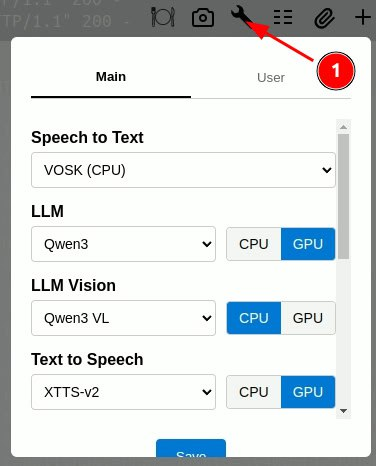
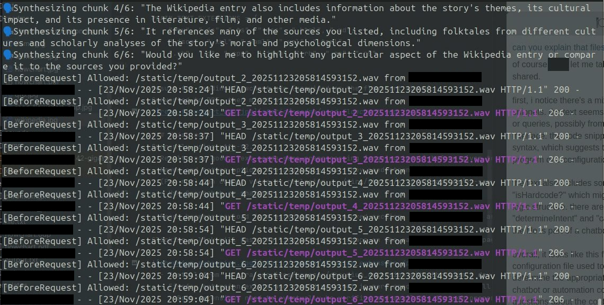

## MIRA = Multi-Intent Recognition Assistant

A fully local, voice-first home assistant powered by LLMs: No cloud. No tracking.

**Check the video demo** (only 8MB but takes a while):

<video src="https://github.com/user-attachments/assets/24d33745-3181-498f-b466-828c7b116cea" width="640" height="480" controls>
  Your browser does not support the video tag.
</video>

[video_demo.mp4](static/readme/video_demo.mp4)

**True multi-intent** resolution per query:
- (added after making the video, sorry)


It is **very** alpha and currently only suited to DIY enthusiasts.
- Changelog: [CHANGELOG.md](CHANGELOG.md)
- I apologize in advance to anyone going insane trying to install.
- Check [install.md](INSTALL.md) for a rough guide (I'll help if asked).

**General idea**:
- Google, Alexa et al. are not allowed in my home or phone: **DIY**.
- Have a **voice-in**, **voice-out**, LLM powered home assistant.
  - (Privately) accessible through a cloudflare tunnel from anywhere using a phone or device with a browser.
  - Currently, controls my smart plugs, music, shopping and to-do list, searches Wikipedia, gives weather forecast and more.
  - Has a Chromium/Firefox extension (unsigned for now, requires dev-mode enabled). 
- Run the user query through an LLM intent interpreter that catches malformed input and decides what to do.
- Use it for data sensitive tasks.

**Hardware**:
<table>
  <tr>
    <td>
      <table>
        <thead>
          <tr>
            <th style="text-align:center">Minimum</th>
            <th style="text-align:center">Recommended</th>
            <th style="text-align:left">Comment</th>
          </tr>
        </thead>
        <tbody>
          <tr>
            <td style="text-align:center">16GB VRAM</td>
            <td style="text-align:center">More</td>
            <td>16GB will leave about 4GB<br>for context window.</td>
          </tr>
          <tr>
            <td style="text-align:center">50 TFLOPS</td>
            <td style="text-align:center">Faster</td>
            <td>Speed is king in our use case.</td>
          </tr>
          <tr>
            <td style="text-align:center">32GB RAM</td>
            <td style="text-align:center">More</td>
            <td>Qwen3-VL@8B_Q6K(~9GB);<br>Vosk (~4GB); + context.</td>
          </tr>
          <tr>
            <td style="text-align:center">8c/16t CPU</td>
            <td style="text-align:center">Faster+More</td>
            <td>VL is slow on CPU.</td>
          </tr>
        </tbody>
      </table>
    </td>
    <td style="vertical-align:top; padding-left:20px;">
      
    </td>
  </tr>
</table>

**DO NOT** overload your VRAM. You'll crash with 'oom' and can either delete the DB (generates new on startup) or edit the settings manually.
- TODO: Prevent insane user settings/recover from insane settings.


### Flow:

<table>
  <tr>
    <td align="center"><em>Demo</em></td>
    <td align="center"><em>Flowchart</em></td>
  </tr>
  <tr>
    <td></td>
    <td></td>
  </tr>
</table>

### isVoice+Textify
Currently using Vosk, running on CPU.

Why Vosk when better models exist? Short answer: Hardware.

- Results are mixed, the LLM interpreter catches some but not all errors.
  - Vosk is a very polite listener: 
    - ~~Starting a query with "please" will jolt it to attention with the P and familiar word and reduce error rate.~~
    - Having no accent/being a native speaker helps.
    - Not having a cold helps.
    - ~~Pressing the voice button a short while before speaking and holding it a little afterward helps.~~ 
  - Solution (implemented, testing): Have the user record a wake word (please). Prepend to every voice query. 
    - Until frontend implementation: Drop your own "please" into ...mira/static/sounds/please.wav
  - Solution (implemented, testing): Make the button give visual feedback .2 seconds after being pressed and let it record .2 seconds longer.

<table>
  <tr>
    <td></td>
    <td></td>
  </tr>
  <tr>
    <td>
      First, third and fourth query are correct.<br>
      Second query input was equal to third.<br>
      Vosk deviated too far for the LLM intent interpreter.
    </td>
    <td>
      Query was: Turn the bathroom on and play the hammer selection.<br>
      (HammerSelection is HammerFall best of)
    </td>
  </tr>
</table>

**Long Term Solution**: Use Nvidia canary which is apparently 4x as accurate; Problem: 5GB model and can't run on cpu with reasonable speed. Faster whisper is smaller but still must be held in VRAM at all times for response time. FW is also not CUDA13 updated.
  - Canary is probably required for proper "real world" application with low error rates.

### IsDetermined
- Already builds a DB of input and matched command.
- **Not implemented**: For test and debug reasons I don't want to match the input to the resolved commands in the DB yet.
    - **Long Term**: Implement and save the inference cost for repeating commands.

### IsHardcode
- Does what it does but is not very extensive.
- **Wikipedia**: Grabs roughly 2k context from the wikipedia entry and answers questions.
  - Works reasonably well for a quick check.
  - The wikipedia keyword must be present.


```
[BeforeRequest] Authenticated.
[User] ask_intent user_msg: give me a meta level summary of the story
[Intent] Generating response...
Llama.generate: 3 prefix-match hit, remaining 281 prompt tokens to eval
llama_perf_context_print:        load time =      71.06 ms
llama_perf_context_print: prompt eval time =      53.51 ms /   281 tokens (    0.19 ms per token,  5251.35 tokens per second)
llama_perf_context_print:        eval time =     281.73 ms /    23 runs   (   12.25 ms per token,    81.64 tokens per second)
llama_perf_context_print:       total time =     341.08 ms /   304 tokens
llama_perf_context_print:    graphs reused =         22
[User] give me a meta level summary of the story
[Mira] Generating response...
Llama.generate: 3 prefix-match hit, remaining 3340 prompt tokens to eval
llama_perf_context_print:        load time =      71.06 ms
llama_perf_context_print: prompt eval time =     520.63 ms /  3340 tokens (    0.16 ms per token,  6415.32 tokens per second)
llama_perf_context_print:        eval time =    2427.68 ms /   185 runs   (   13.12 ms per token,    76.20 tokens per second)
llama_perf_context_print:       total time =    3003.96 ms /  3525 tokens
llama_perf_context_print:    graphs reused =        184
```
- **Web search**: 
  - **Dummy pipeline**: Gets results from DuckDuckGo but the converter struggles with the shitload of adds etc.
  - Possible Solution: Query/prefer specific user defined sites (get through front end or file).
  - Possible Solution: Use the LLM to check individual entries: extract text, score by relevance, possibly prefilter content.
  - Then feed aggregate to chat as context.
  - web search keyword must be present (currently "search" and "web").


- Solution (not implemented) to remove hardcoded keywords: Build an (optional) confirmation loop: intent:web_search/wikipedia, get_confirmation, do_web_search

### Determine Intent
- Pretty solid, needs some prompt engineering, possibly better naming schemes for the commands and some tightening of the voice-in error correction.
- ~~Currently, it does a single command per query (debug behaviour).~~
  - ~~**Long Term**: Wrap the chat+intent route in a for every command loop.~~

Implemented multi intent capability per query (currently testing).
  


### CallFunction

    if command == "play music": music_play()
    if command in ("pause playback", "stop playback"): music_pause()
    if command == "next song": music_next()
    if command == "previous song": music_previous()
    if command.startswith("play "):
        stem = command.removeprefix("play ").strip()
        if stem in PLAYLIST_STEM: music_load(command)
    # chromium
    if command == "open Chromium": chromium_start()
    if command == "close Chromium": chromium_terminate()
    # gui
    if command == "remove attachment": HasAttachment.set_attachment(False)
    # ShoppingList
    if command == "new ShoppingList": new_shopping_list(list_items)
    if command == "append ShoppingList": append_shopping_list(list_items)
    # To-Do List
    if command == "new ToDoList": new_to_do_list(list_items)
    if command == "append ToDoList": append_to_do_list(list_items)
    # Smart plugs
    for plug_name in PLUGS:
        if command == f"on {plug_name.capitalize()}":
            turn_on(plug_name)
        elif command == f"off {plug_name.capitalize()}":
            turn_off(plug_name)

### CallChat
Answers anything that is not a command
- Reads and discusses files:
  - Will likely not do very well with complex/long documents (it's a small model).
  - "Reads": .doc, .docx, .odt, .rtf, .xls, .xlsx, .ods, .csv, .ppt, .pptx, .odp, .html, .pdf, .txt .py, .js, .ts, .css, .md, .json, .xml, .yaml, .yml, .toml, .sh, .c, .cpp, .java, .rb, .go, .rs
  - "Sees": .png, .jpg, .jpeg, .gif, .bmp, .tiff, .svg, .webp
- TODO: Have the VL model read embedded pictures and tables, then merge with the text again.

<table>
  <thead>
    <tr>
      <th style="text-align: center;">Flowchart (flowchart.odp to PDF to pdfminer6)</th>
      <th style="text-align: center;">Python Code (services/llm_chat.py)</th>
    </tr>
  </thead>
  <tbody>
    <tr>
      <td style="text-align: center; vertical-align: top;">
        <br>
      </td>
      <td style="text-align: center; vertical-align: top;">
        <br>
      </td>
    </tr>
  </tbody>
</table>

### Voice out:
Currently using xtts-v2.
- Why xtts-v2 when better models exist? Short answer: Hardware. 

[output_demo.wav](static/readme/output_demo.wav)

<audio controls style="width: 100%; max-width: 300px;">
  <source src="static/readme/output_demo.wav" type="audio/wav">
  Your browser does not support the audio element. 
  <a href="static/readme/output_demo.wav">Download demo</a>
</audio>


- Results are good. Text needs some preprocessing (ongoing tweak) before given to the model.
- Newer and better models for inference are available, but they need stronger hardware.
  - Xtts-v2 struggles somewhat with punctuation, code, numbers, etc. but does well on "normal" text.
- (For now) Can change voice by replacing .../mira/static/xtts-v2/samples/en-sample.wav
  - Use Spongebob, 7of9 or whatever.
  - I like the xtts-v2 sample, actually.
- Also streams the voice chunks to the frontend (output_1 is already playing while chunk 4 is being made):



### Reads browser payload from extension (url, marked section, image gets passed as attachment):

Clicking a link will pass the link_url, empty space on the page will pass the page_url, marking/highlighting text will pass that text, image needs qwen vl(implemented, testing).


  - Install from ...mira/services/browser/chromium_extension with Chromium's dev mode enabled
    - Now able to pass images
  - Firefox extension exists and should work but is more annoying to use/install
    - Both extensions need to eventually be verified and available through proper channels.
    - Firefox extension possibly cant pass pictures properly

### Roadmap:
### Have it accessible from any client in the local network and from my smartphone through the web (done)
- Creates additional Qt6 window on localhost
- Setting the web API requires much DIY (cloudflare tunnel, buy domain, file edits)
- Serving to home network with https requires to create a ssl cert with mkcert, otherwise much access to the phone (camera, mic) is restricted.
  - ~~Solution: check cert health: auto generate if close to expiry or not present; Problem fails without mkcert installed~~
  - Implemented automatic certificate generation and refresh

### Give control of Tasmota smart plugs (done, can be entered with name+ip in front end)
- Commands dynamically generated: on Name; off Name

### Give control of heating units (TO-DO: seems to need integration with home assistant)

### Have it read files (done for many common formats, ~~but not pictures~~)
- ~~Images need qwen vl:~~ We currently constantly hold vosk@cpu, vl@cpu(9GB), assistant(7,5GB)@gpu, text to speech (2,1GB)@gpu
  - Let's assume 2GB VRAM for OS: 2+2,1+7,5=11,6GB: leaves ~4GB VRAM for context
  - ~~Problem: compiled llama-cpp-python to work with qwen3 vl (8b), but it's borderline unusable as a chatbot~~
  - ~~Problem: tested someone else's llama-cpp-python for qwen3 vl, but it's still unusable as a chatbot~~
    - ~~Solution: Hold both models in VRAM; Problem: User needs at least 24gb VRAM, I don't have enough VRAM to test~~
    - ~~Solution: Unload the text model and load the vl model, do inference, reload the text model; Problem: incredible latency increase; likely unfeasible~~
    - Solution (implemented, testing): Load VL model to CPU: Does well on barcode scan (~1.5s) but takes ~30s for a real picture.
- ~~Come up with a way to have it read images (ongoing)~~

### Have it control music (done, can dynamically play any playlist that clementine can process). Drop playlist into ...mira/playlists)
  - I still buy music, preferably directly from the artist: Probably no spotify support from me.

### Use for shopping and to-do list (done)
  - Accepts new shopping/to do list + items and append shopping/to do list + items
  - Delete items from front end (tap) or by starting new list


### Interpret weather data (done, currently can give today, tomorrow, the day after).
- More context is possible but these small models will start struggling (needs prompt engineering). 
- Queries open-meteo.com API and exposes IP, longitude, latitude 
- Must enter Lat and Lon in frontend for the query to succeed

### Make chat sessions client unique and allow multiple users (not implemented)

### Make chat context a rolling window
- ~~Currently fails on max context (start new conversation with + button)~~
- (implemented, testing) 
  - Still needs a guard against single query that exceeds context

### Understand time and user schedule (done, sort of, needs some more tweaking and calendar access)
- It references fun because sunday is defined as free time in my schedule. 


### Read phone calendar (not implemented)
- Most of these calendar apps use sqlite (far as i can tell)
  - That means only 1 write con: Potentially locks the DB if I add write to calendar functions.
  - Can use read only to make periodic copies
  - Add calendar items to the prompt/schedule
  - Add a nightly check to inform of upcoming calendar items ahead of time.

### Integrate with Thunderbird (not implemented)
- Preliminary review suggests it could be relatively simple with a custom extension.
  - Should be able to make it store mail+attachment in file system
  - Should be able to make it write basic mails.
  - Should be able to summarise new and unread mails.

### Take a picture (done, testing)
Really requires more hardware than I currently have but works.
- Camera access from phone and ability to send a picture to flask (done)
- ~~If you have the hardware (24GB VRAM min) set: ```.../mira/services/globals.py n_gpu_layers=-1```~~


- Though on CPU that took ~30 seconds:
```
Llama.generate: 57 prefix-match hit, remaining 1 prompt tokens to eval
llama_perf_context_print:        load time =     122.67 ms
llama_perf_context_print: prompt eval time =    1457.18 ms /   339 tokens (    4.30 ms per token,   232.64 tokens per second)
llama_perf_context_print:        eval time =   31321.20 ms /   252 runs   (  124.29 ms per token,     8.05 tokens per second)
llama_perf_context_print:       total time =   31677.31 ms /   591 tokens
llama_perf_context_print:    graphs reused =          0
```

### Nutrition (WIP - not functional)
The idea is to create a database of 
- kcal, carbs, fat, protein, 
- daily_total, daily_allowed
- which products
- activities
- dietary goal
- age, sex, weight, bmi, etc.

Then query the llm for improvements, have it suggest substitute products, suggest a meal, encourage, whatever.

- ~~The **barcode scanner** (sort of)~~
  - ~~I've tried a lot of these, and they are all finicky one way or another.~~
  - ~~Solution1: Use qwen vl; Problem: Hardware~~
    - ~~Must keep js scanner as optional (improve or use different scanner)~~
  - ~~Solution2: Possibly send a stream of pictures to the backend and do the calcs on proper hardware myself with python.~~

**Barcode Scanner**:
- Made Qwen3 VL read barcodes:


```
llama_perf_context_print:        load time =     132.12 ms
llama_perf_context_print: prompt eval time =    1660.66 ms /    81 tokens (   20.50 ms per token,    48.78 tokens per second)
llama_perf_context_print:        eval time =    1430.54 ms /    12 runs   (  119.21 ms per token,     8.39 tokens per second)
llama_perf_context_print:       total time =    1566.72 ms /    93 tokens
llama_perf_context_print:    graphs reused =          0
[Barcode] Determined as: 5449000038715
```

- Getting the **product info** from world.openfoodfacts.org (sort of)
  - Problem: Their DB does neither return normalized, nor correct (sample products=8, fully wrong entries=3) results
    - Same field: 38,5g (14 x 2,75g), 1l, 125 g, 140g, 1pcs
  - Solution: Refactor everything to use that DB only as suggestion, aggressively attempt to normalize it, have user correct entries
    - eventually builds local trusted DB
      - needs to be updatable, but refuse an overwrite from openfoodfacts
  - Solution: Use qwen vl, have the user take (up to three?) photos; Problem: Hardware
    - Must keep manual input (vl mode must be optional) in any case

- Wasn't really able to test the front end beyond scanning

### Give it its own shell and user privileges (not implemented)
- Simple enough. Don't have a good use case yet.

### Have it serving files in a NAS like fashion (not implemented)

### Make the installation process so easy that people don't turn insane (not implemented)