## MIRA = Multi-Intent Recognition Assistant

A local, **voice-in**, **voice-out**, LLM-powered assistant, that actually integrates into your day and is not just a chatbot.

**Features**:
- Provides orientation: *Quick answers and real time awareness*
- Private by design: No cloud, No tracking. Your data stays where it belongs.
- Always available on your phone.
- Serve it to your local network, or securely tunnel via Cloudflare.
- True multi intent recognition: *Turn the kitchen on. Play music and add eggs to my shopping list.* 
- "Reads" pictures from the phone camera: *What is that plant in my garden?*
- Integrates with Chromium on the host: *What is that article about? Does that source mention X?*
- Scans barcodes, tracks nutrition, dietary goals and builds a trusted local DB. 
- Controls smart plugs (Tasmota), Plays media, Handles shopping and to-do lists, Searches Wikipedia, Gives (3-day) weather forecast, and more.

It is **very** alpha but now comes with a Dockerfile:
- [CHANGELOG.md](CHANGELOG.md)  |  [INSTALL.md](INSTALL.md) (I'll help if asked).

Check the (*outdated*, alpha2) **video demo**:
<video src="https://github.com/user-attachments/assets/24d33745-3181-498f-b466-828c7b116cea" width="640" height="480" controls>
  Your browser does not support the video tag.
</video>

**True multi-intent** resolution per query:
<table>
  <tr>
    <td style="text-align: center; padding: 8px;">
      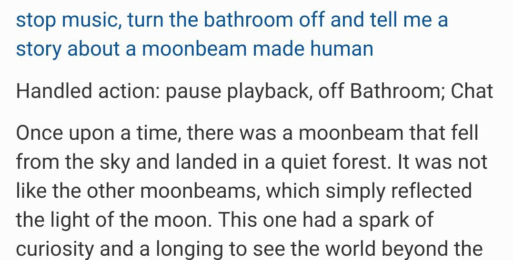
    </td>
    <td style="text-align: center; padding: 8px;">
      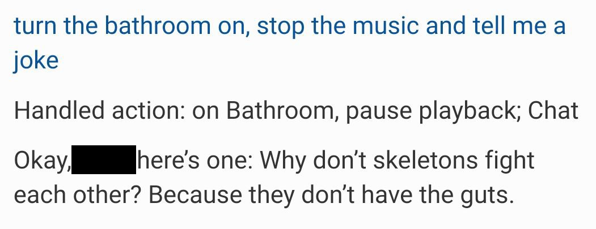
    </td>
  </tr>
</table>

### Flow:

<table>
  <tr>
    <td align="center"><em>Demo</em></td>
    <td align="center"><em>Flowchart</em></td>
  </tr>
  <tr>
    <td>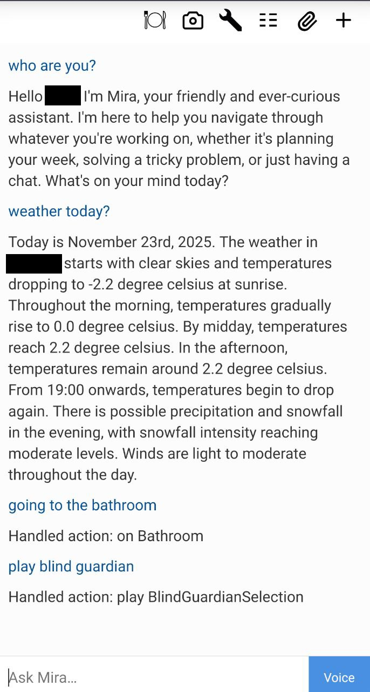</td>
    <td>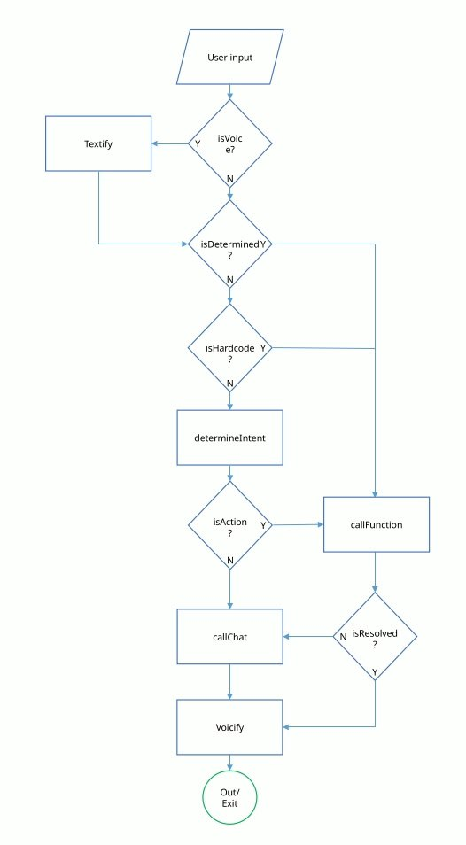</td>
  </tr>
</table>

### Speech to text (VOSK for now) + Interpreter and text to speech (XTTS-v2 for now):
- Matches commands to user input, splits the user input accordingly and attempts to correct voice-in errors.
- Streams voice chunks to keep latency down, use any voice you like.
<table>
  <tr>
    <td>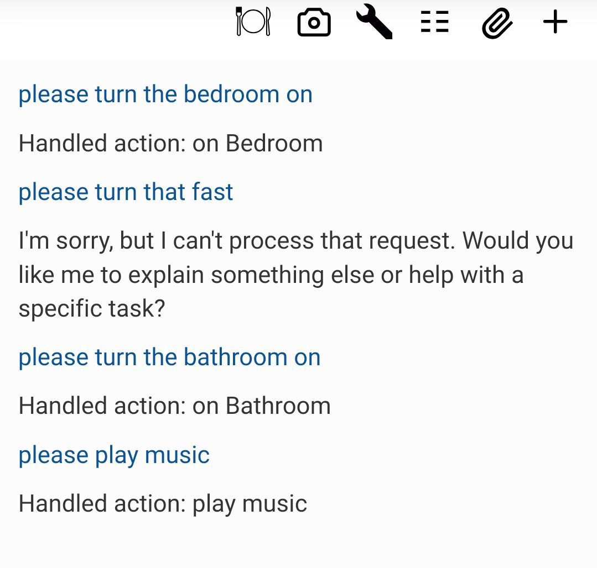</td>
    <td>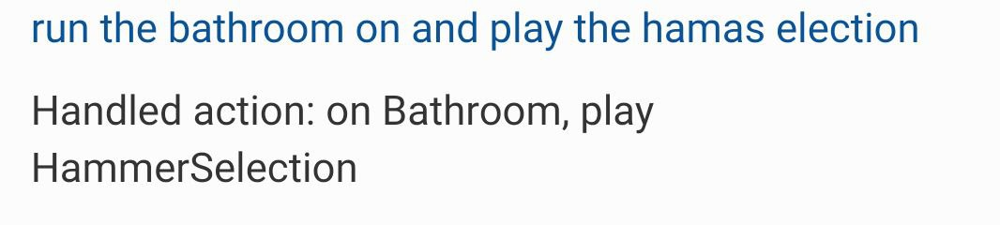</td>
  </tr>
  <tr>
    <td>
      Vosk deviated too far for the LLM intent interpreter.
    </td>
    <td>
      Query was: Turn the bathroom on and play the hammer selection.<br>
    </td>
  </tr>
</table>

[output_demo.wav](static/readme/output_demo.wav)

- (Normalized) Results are okay for voice-out, XTTS-v2 struggles somewhat with code, markup, etc., but does well on "normal" text.
- Disclaimer: Results are mixed for voice-in, the LLM interpreter catches some but not all errors.

**Long Term**: Implement various additional options with lower error rates, like Nvidia Canary, Faster Whisper, etc.

### Take a picture
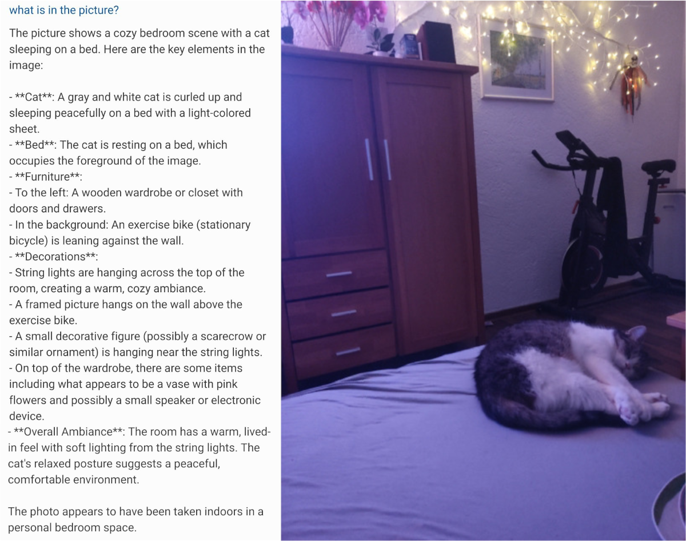


### Nutrition
<table>
  <!-- Row 1: Barcode scanner -->
  <tr>
    <td style="vertical-align: top; padding: 8px 16px 8px 0; text-align: center;">
      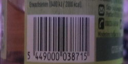
      <br>
      <em>Barcode captured via phone camera</em>
    </td>
    <td style="vertical-align: top; font-family: monospace; font-size: 0.9em; background-color: #f5f5f5; padding: 12px; border-radius: 4px; white-space: nowrap;">
      total time = 1566.72 ms / 93 tokens<br>
      [Barcode] Determined as: 5449000038715
    </td>
  </tr>
  <!-- Row 2: Nutrition demos -->
  <tr>
    <td style="text-align: center; padding: 16px 8px 8px 0;">
      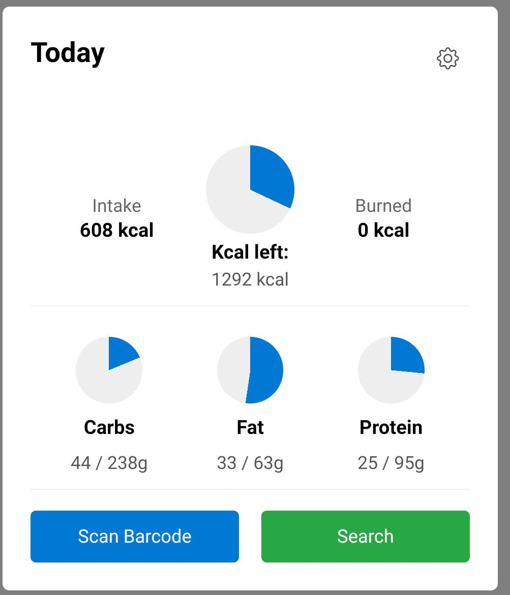
      <br>
      <em>Nutrition dashboard: daily log</em>
    </td>
    <td style="text-align: center; padding: 16px 0 8px 8px;">
      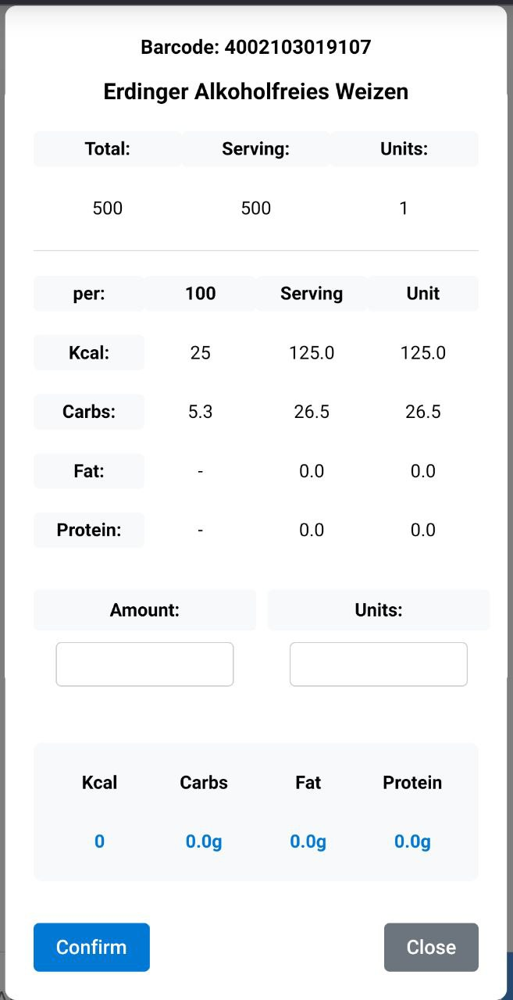
      <br>
      <em>Product view with macro breakdown</em>
    </td>
  </tr>
</table>

### Reads context from Chromium 
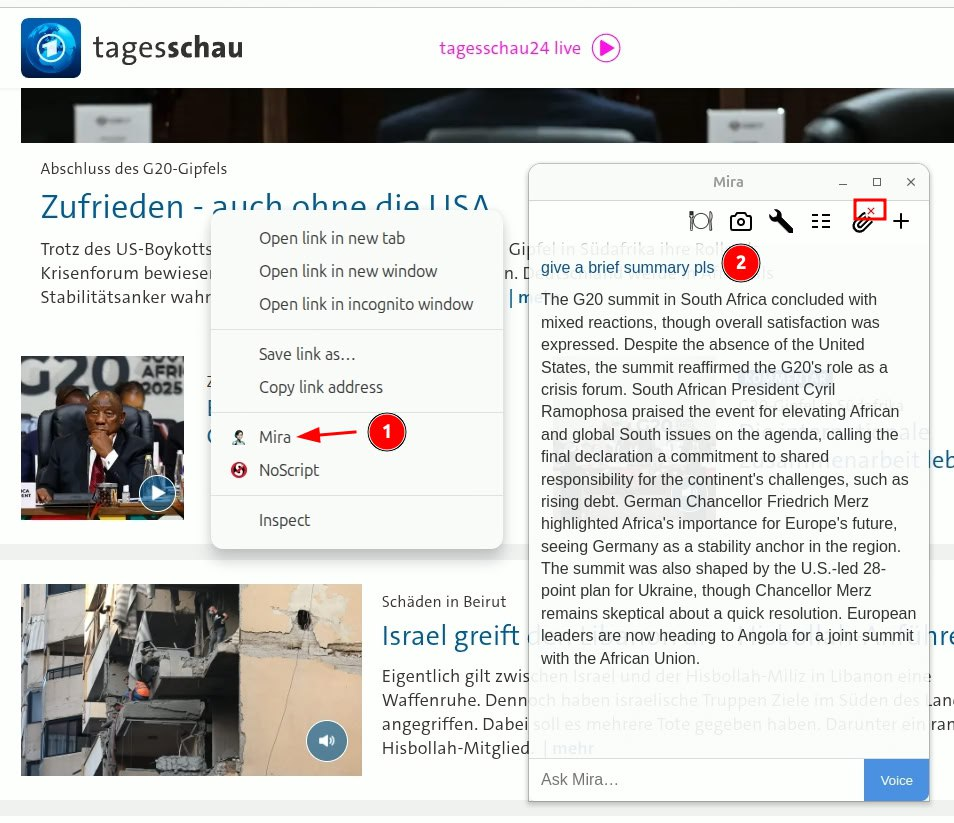

### Wikipedia
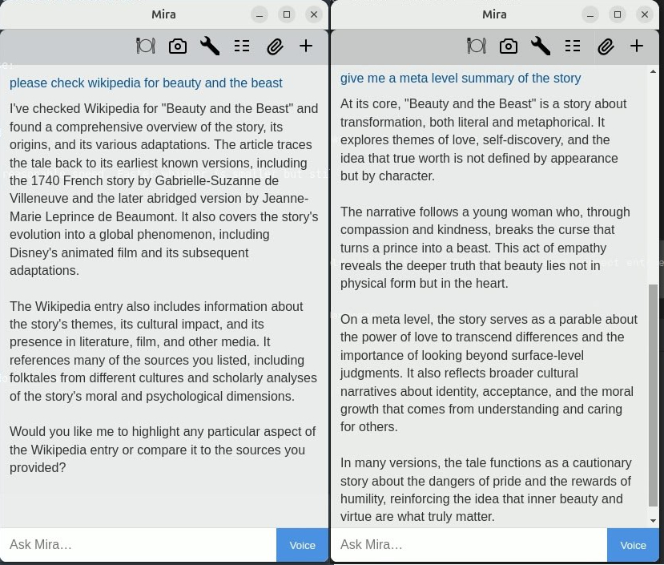


### Chat
Answers anything that is not a command.
- Reads and discusses files:
  - "Reads": ```.rtf, .html, .pdf, .txt .py, .js, .ts, .css, .md, .json, .xml, .yaml, .yml, .toml, .sh, .c, .cpp, .java, .rb, .go, .rs```
  - "Sees": ```.png, .jpg, .jpeg, .gif, .bmp, .tiff, .svg, .webp```

<table>
  <thead>
    <tr>
      <th style="text-align: center;">Flowchart (flowchart.odp to PDF to pdfminer6)</th>
      <th style="text-align: center;">Python Code (services/llm_chat.py)</th>
    </tr>
  </thead>
  <tbody>
    <tr>
      <td style="text-align: center; vertical-align: top;">
        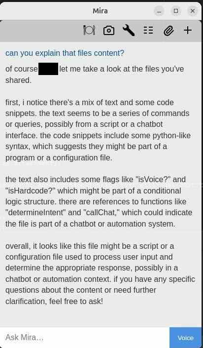<br>
      </td>
      <td style="text-align: center; vertical-align: top;">
        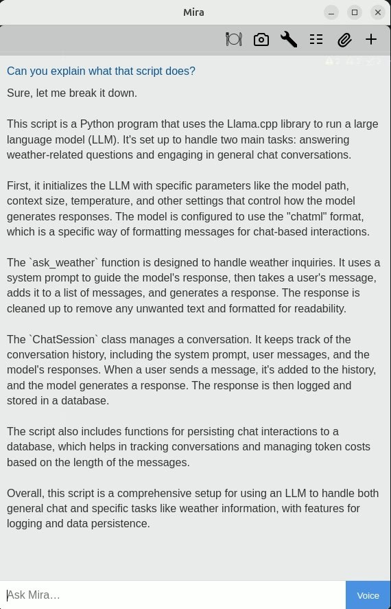<br>
      </td>
    </tr>
  </tbody>
</table>

### Give control of Tasmota smart plugs
- Enter name and IP in the web frontend.

### Control media (music, video, anything that VLC plays).
  - Dynamically plays any playlist with VLC.
  - I still buy music, preferably directly from the artist: So, no Spotify support from me.
  - Plays .m3u8 (TV streams etc. as long as your VLC can play them (possibly geolocated))

### Use for shopping and to-do list
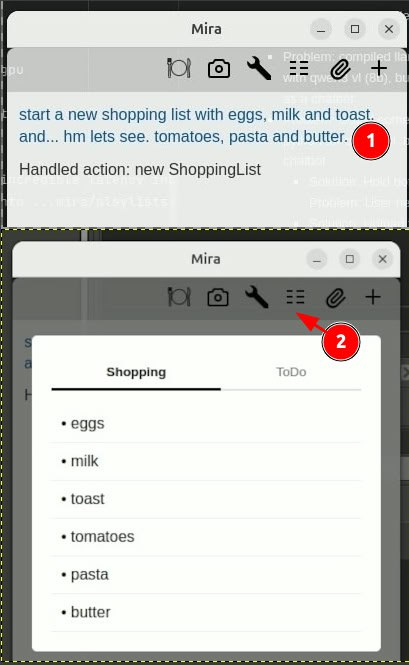

### Understand time and user schedule (done, sort of, needs some more tweaking and calendar access)
- It references fun because sunday is defined as free time in my schedule.
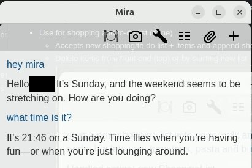

### What's still coming and needs fixing? [TODO.md](TODO.md)